# Lark diagrams

In the Lark doc, on a blank line type `/Mermaid`, then paste **one** block below. Paste the code only. Leave out the ` ```mermaid ` lines.

---

## 1. System architecture

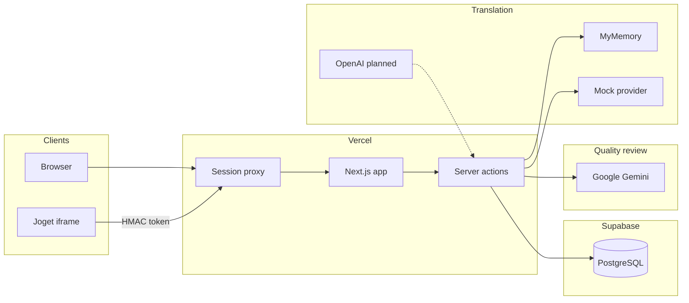

## 2. Two application models

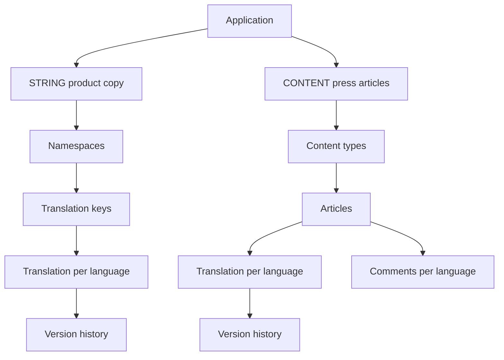

## 3. Sign in

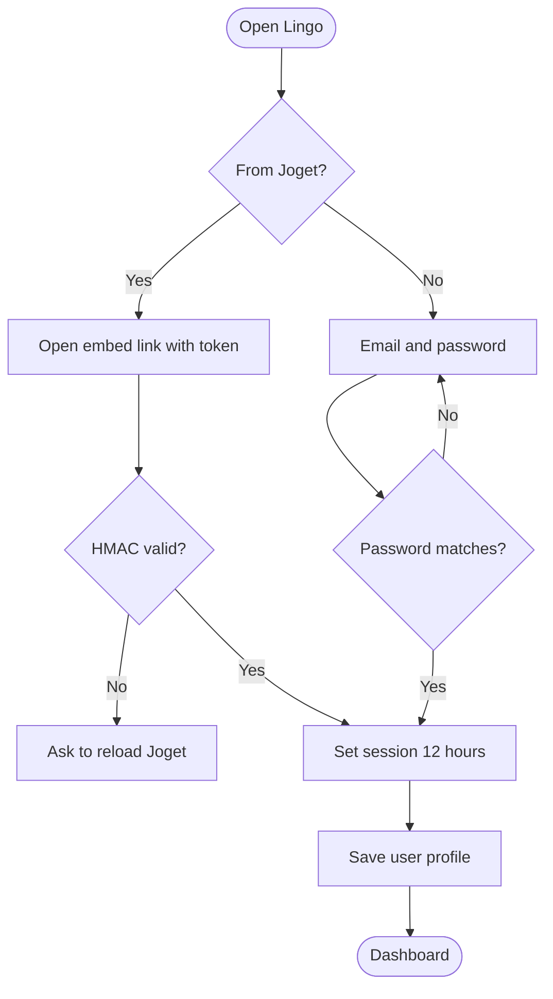

## 4. Create an application and invite

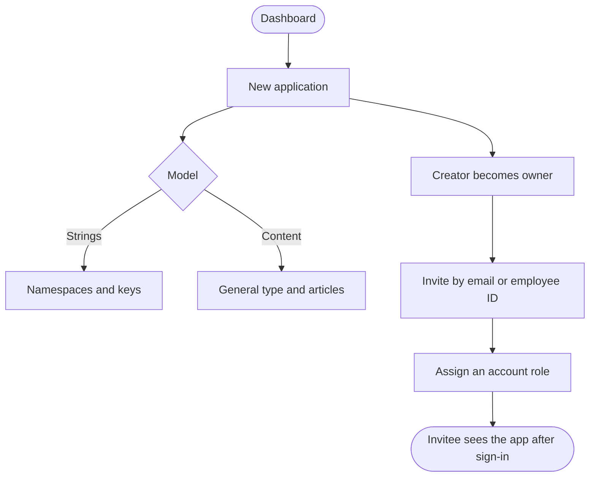

## 5. Press article workflow

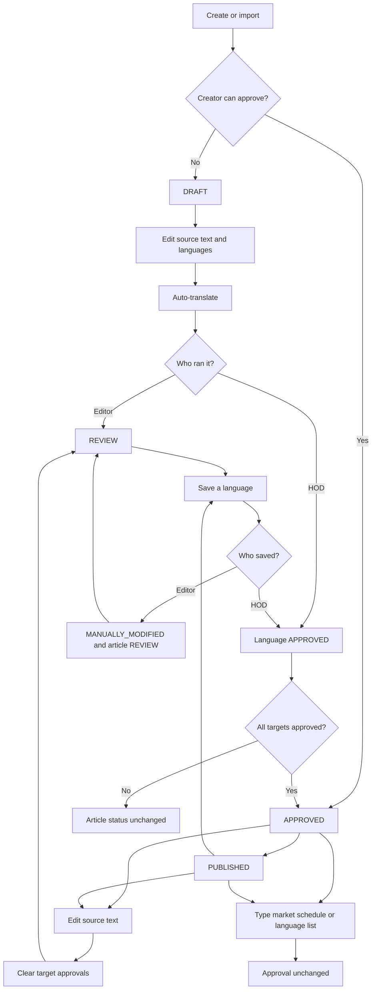

## 6. Translation status

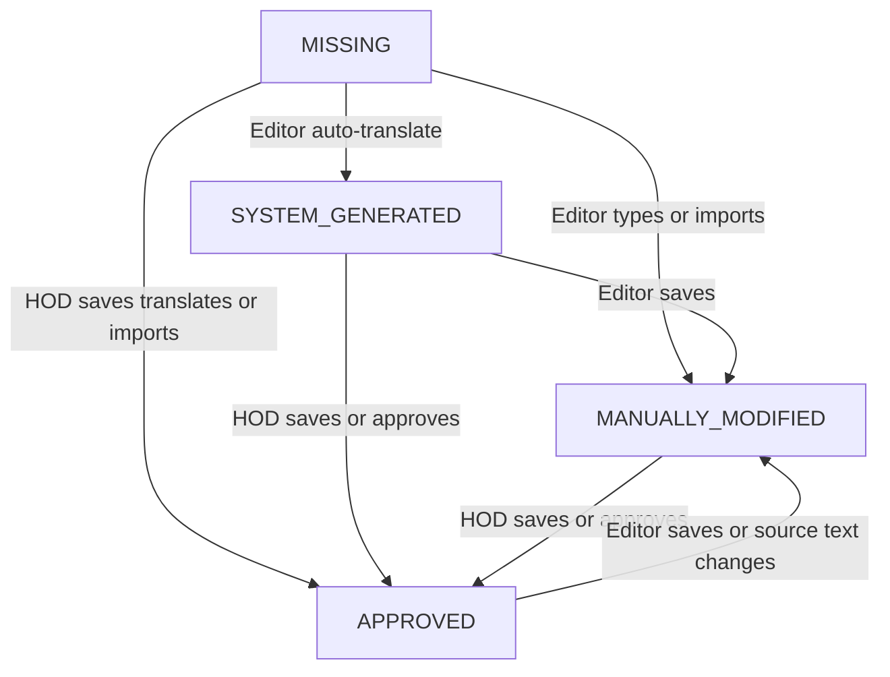

## 7. Product string workflow

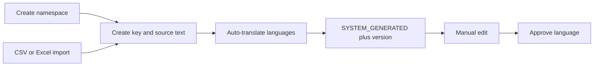

## 8. Import

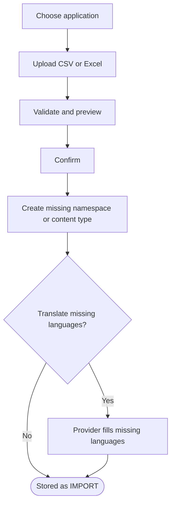

## 9. Data model

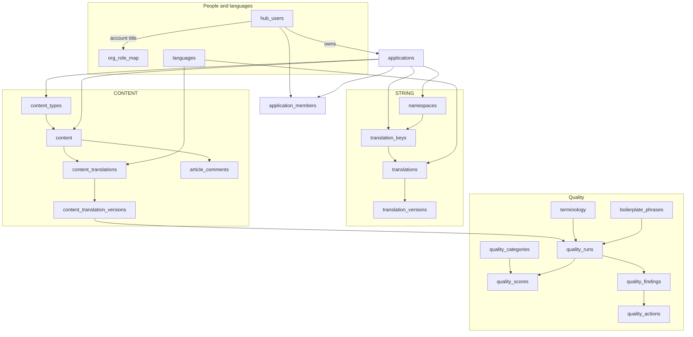

## 10. Export articles

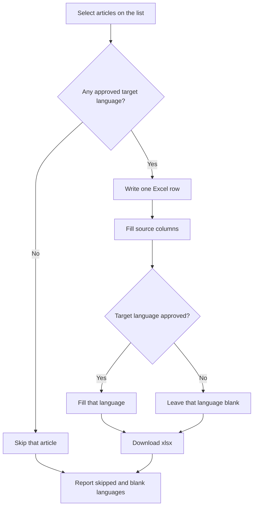

## 11. Quality review

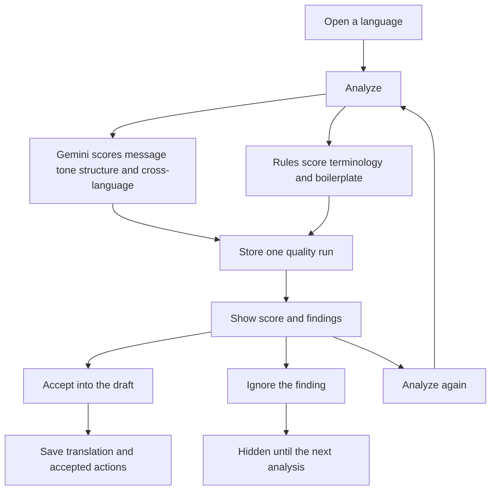
