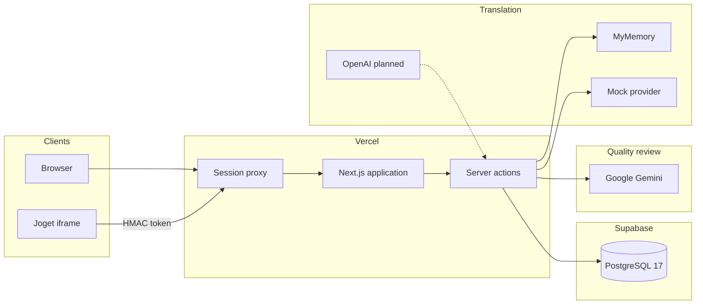
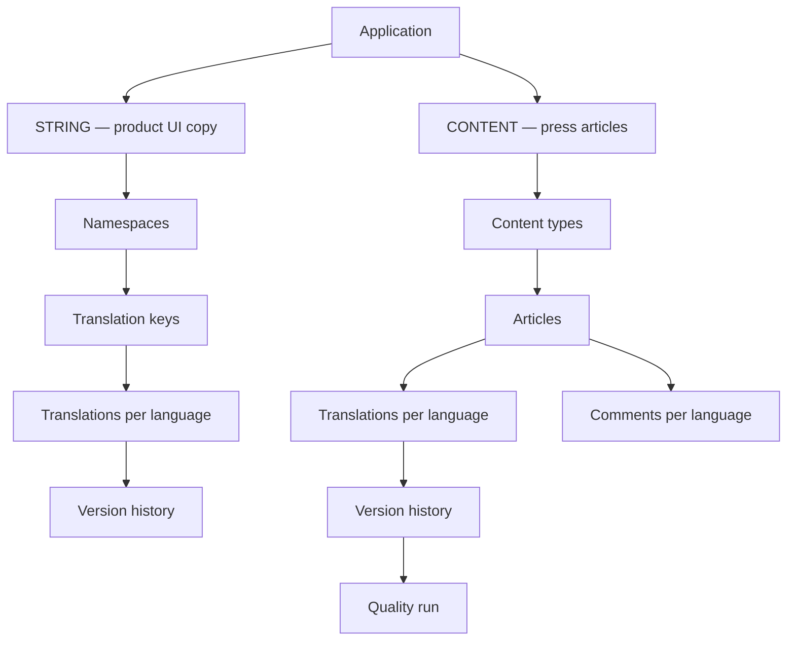
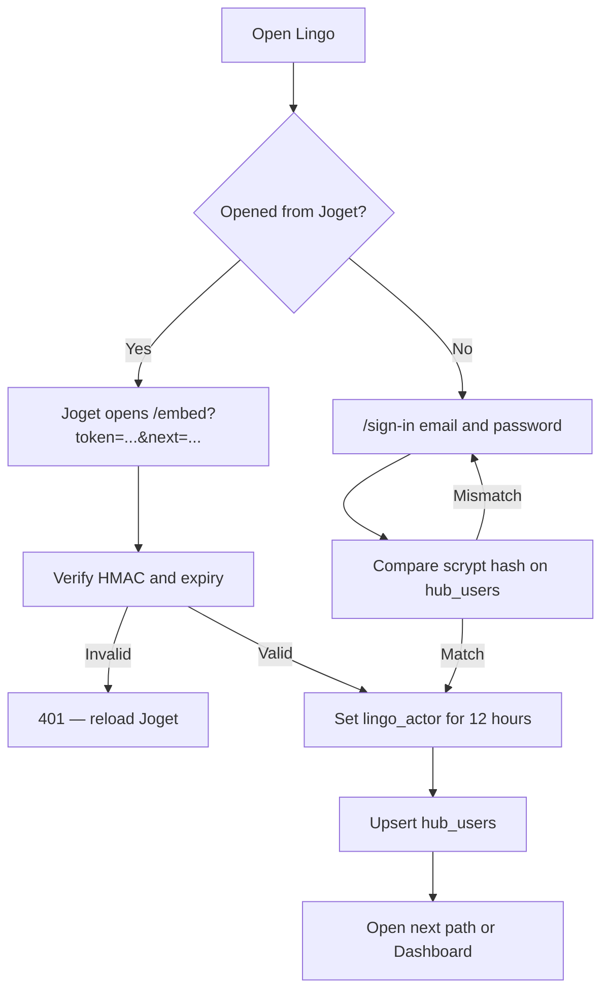
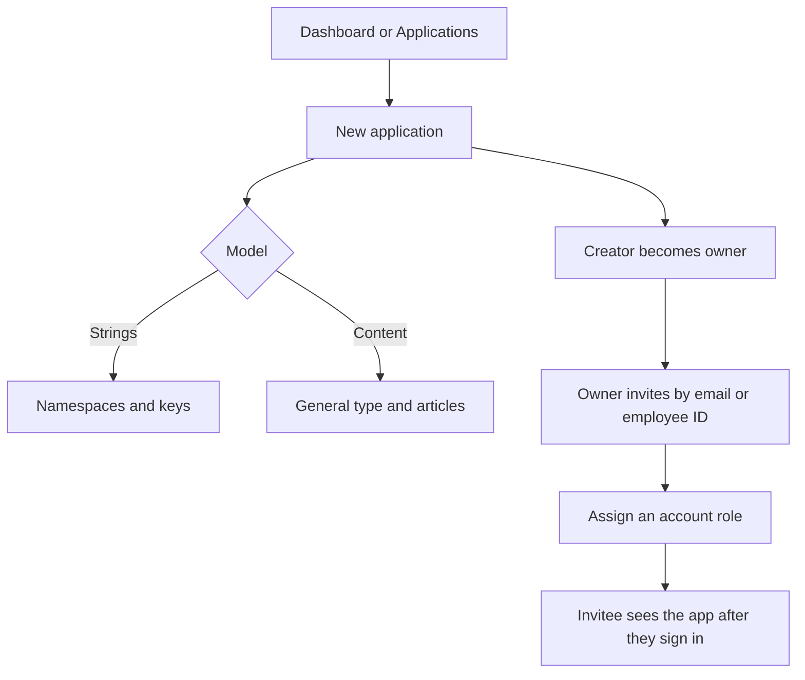
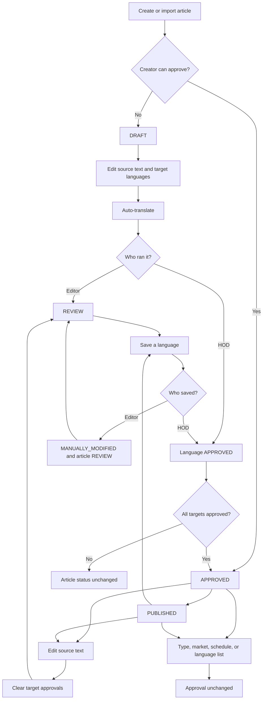
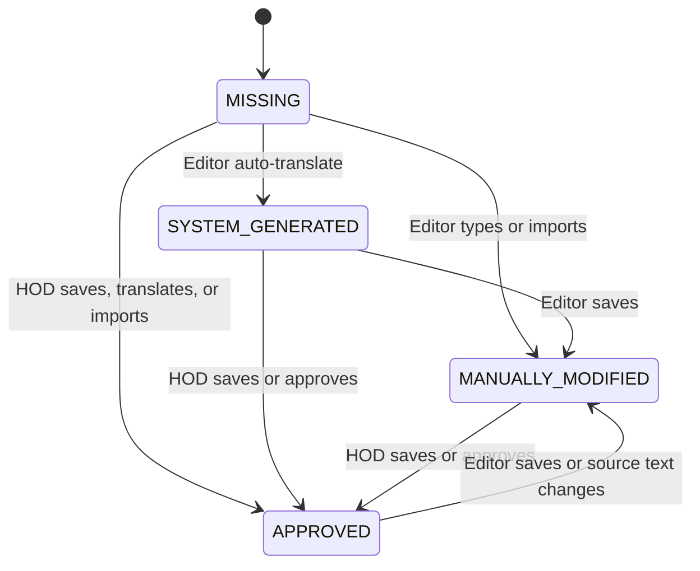
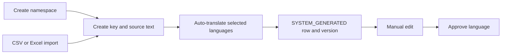
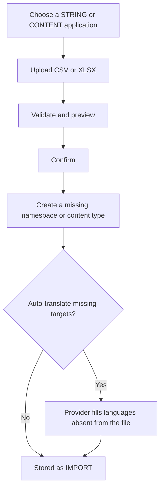
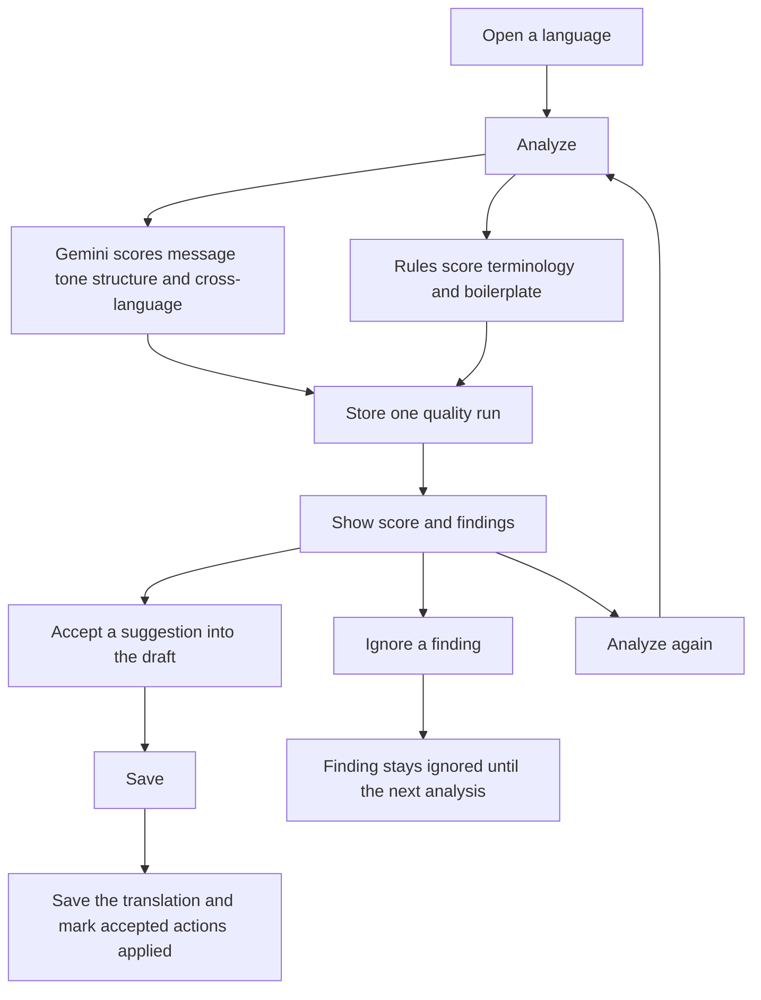

# Lingo — Translation Hub

Technical documentation · V0.1 · Under development

Lingo is the internal multilingual content hub for MR.DIY applications. Editors create source copy, generate or import translations, review them, and approve them before export or publish. The current environment is Next.js on Vercel with a Supabase PostgreSQL database.

---

## 1. Technical overview

| Field | Details |
| --- | --- |
| System name | Lingo — Translation Hub |
| Current version | V0.1 (`package.json` `0.1.0`) |
| System status | Under development |
| Environment | Supabase + Vercel (development) |
| Technology stack | Frontend and backend: Next.js. Database: Supabase (PostgreSQL). Translation: MyMemory for development, or Gemini with the quality key. OpenAI is the planned translation provider for QAT and production. Translation quality review: Google Gemini, plus terminology and boilerplate rules. |

---

## 2. System architecture



The browser never calls MyMemory, Gemini, or the database with a user credential. Pages and server actions run on the Next.js server. The server reads and writes Supabase with the project publishable key, and it calls the translation provider and Gemini from the server.

### 2.1 Application components

**Next.js application.** Provides the user interface and the server-side functions for translation management: applications, languages, content, string keys, import, export, comments, version history, and translation quality review. UI and mutations live in one App Router project. Mutations are server actions in `lib/actions/`.

**Supabase database.** Stores source content, translations, version history, workflow status, approvals, comments, users, application membership, quality categories, terminology, boilerplate, and quality runs. Row-level security is enabled. Current policies allow the server role through; who can see or change an application is enforced in application code (`lib/auth/access.ts`).

**Translation service.** Receives source text from the Next.js server, returns translated text, and the server stores the result for review. The active provider is selected with `TRANSLATION_PROVIDER`: `mymemory`, `mock`, or `gemini`. Gemini uses the same `GEMINI_API_KEY` and `GEMINI_MODEL` as quality review. An OpenAI provider is planned for QAT and production and is not wired in V0.1.

**Quality review.** After a translation exists, the server can score it. Google Gemini scores message, tone, structure, and cross-language. Terminology and boilerplate are checked against lists stored in the database. The article screens do not call Gemini themselves.

**Joget.** MR.DIY’s existing portal. Joget does not share its session cookie with Lingo. It opens Lingo in an iframe with a short-lived signed token. People who are not coming from Joget sign in on `/sign-in` with email and password. Both paths end in the same `lingo_actor` session cookie.

### 2.2 Request path

1. `proxy.ts` runs on each request. Paths other than `/sign-in`, `/setup`, `/auth/*`, and `/embed*` require a valid `lingo_actor` cookie. A missing or expired cookie redirects to `/sign-in`.
2. The cookie is an HMAC-SHA256 token (`lib/auth/actor.ts`). The server verifies the signature with `JOGET_EMBED_SECRET` and checks expiry.
3. On the first authenticated request, Lingo upserts a `hub_users` row from the token (username, display name, email, optional employee ID) and refreshes `last_seen_at`.
4. Server actions then check application membership before reading or writing that application’s data.

### 2.3 Two product models

Every application is one of two models. The model is chosen when the application is created and drives the screens under that application.



| Model | Used for | Unit of work | Main screens |
| --- | --- | --- | --- |
| `STRING` | Product interface copy | A key inside a namespace, with one source string and one translation per language | Namespaces, translation keys |
| `CONTENT` | Press and editorial content | An article with a type, title, summary, HTML body, and SEO fields, plus one translation per target language | Types, articles |

---

## 3. Technology stack

### 3.1 Application framework

| Technology | Version | Purpose |
| --- | --- | --- |
| Next.js | 16.2.4 | Full-stack application framework (App Router, server actions) |
| React | 19.2.4 | User interface |
| TypeScript | ^5 | Type-safe application code |
| `@supabase/ssr` | ^0.12.7 | Server and browser Supabase clients, cookie session helper |

### 3.2 Database

| Technology | Version | Purpose |
| --- | --- | --- |
| Supabase JS | ^2.117.2 | Client library for Supabase |
| PostgreSQL | 17.11.0.002 | Relational store for application and translation data |
| Supabase | — | Managed PostgreSQL, used from the Next.js server |

Primary keys are time-ordered UUID v7 (`uuidv7()`), so new rows append in index order.

### 3.3 UI and application libraries

| Technology | Version | Purpose |
| --- | --- | --- |
| Tailwind CSS | ^4 | Styling |
| TipTap | ^3.31.4 | Article HTML body editor |
| PapaParse | ^5.7.0 | Read CSV on import |
| SheetJS (`xlsx`) | ^0.18.5 | Read Excel on import, write Excel on article export |

### 3.4 Authentication and security

| Technology | Purpose |
| --- | --- |
| HMAC-SHA256 (`JOGET_EMBED_SECRET`) | Signs the Joget embed token and the `lingo_actor` session cookie |
| scrypt (Node.js `crypto`) | Password hash for email sign-in (`scrypt$salt$hash`) |
| httpOnly cookie | Session token is not readable from page JavaScript. On HTTPS the cookie is `Secure`, `SameSite=None`, and partitioned so it works inside the Joget iframe |
| Application access checks | Owner, invited member, and superadmin rules in `lib/auth/access.ts` |

### 3.5 External services

| Technology | Purpose |
| --- | --- |
| MyMemory | Temporary free translation API for development. Each request is truncated at 450 characters |
| OpenAI | Planned translation provider for QAT and production. Not implemented in V0.1 |
| Google Gemini | Scores article translations, and translates them when `TRANSLATION_PROVIDER=gemini`. The API key stays on the server |
| Supabase | Database |
| Vercel | Application hosting |
| Joget | Identity source for iframe sign-in |

---

## 4. Data model

Schema is applied in order from `supabase/migrations/001` through `015`. Setup (`/setup`) shows which migrations the connected database still needs. Service call logs are daily files on the server, not database tables.

### 4.1 Tables

| Table | Description |
| --- | --- |
| `languages` | Languages available for translation. Each row has a code, a name, and a status of `ACTIVE` or `INACTIVE`. |
| `hub_users` | Lingo user directory. A row is created when someone signs in from Joget, signs in with email and password, or is invited before their first sign-in. Holds display name, username, email, employee ID, superadmin flag, the password hash used for email sign-in, and `ldap_role` (the account title, such as Executive or HOD). |
| `org_role_map` | Maps an account title (`ldap_role`) to a permission group: `EDITOR` or `HOD`. Titles in the HOD group can approve. Every other title can edit and draft. Maintained from the Roles screen. |
| `applications` | Applications managed for translation. Each application is either `STRING` (product copy) or `CONTENT` (press articles), and has one owner. |
| `application_members` | Users invited to one application. `role` is `EDITOR`, `HOD`, or `ADMIN`. HOD and Admin can approve. Editor can edit and draft. `can_edit` and `can_approve` follow that role. |
| `namespaces` | Groups translation keys inside a STRING application. The name is unique per application. |
| `translation_keys` | A STRING key: key name, source language, and source text. The key is unique per application. |
| `translations` | The current string for one key and one language, plus status and the approval stamp. |
| `translation_versions` | Append-only history of a string translation. |
| `content_types` | Types owned by one CONTENT application. Each row has a stable `code`, a display `name`, a description, `ACTIVE` or `INACTIVE`, and a sort order. The code is unique per application. New articles default to `GENERAL`. An inactive type stays on articles that already use it and is hidden from new choices. Import creates a type when the file uses a code this app does not have yet. |
| `content` | An article in a CONTENT application. `content_type` is that app’s type code. Also stores title, slug, source language, source JSON, market, who submitted it, lifecycle status, target languages, and schedule and publish timestamps. |
| `content_translations` | One translation of an article into one language: title, summary, body, SEO title, SEO description, status, and the approval stamp. |
| `content_translation_versions` | Append-only history of an article translation, stored as JSON of those five fields. |
| `article_comments` | A comment on an article, scoped to one language. |
| `quality_categories` | The checks used to score a translation. `category_type` is `ai` or `rule`. `enabled` turns a check on or off. `configuration.weight` is that check’s share of the score. Seeded checks: message 20, tone 15, structure 15, cross-language 25, terminology 15, boilerplate 10. The code is unique. |
| `terminology` | A preferred wording for one source language and one target language, plus spellings to avoid. One term is unique per language pair, ignoring case. `is_active` includes or excludes it from reviews. |
| `boilerplate_phrases` | A required standard phrase for one language. The name is unique per language, ignoring case. `expected_usage` is `when_source_present`: the phrase is required when the source contains the matching phrase. Seeded with the company introduction. |
| `quality_runs` | One quality analysis of an article translation. Stores provider, model, languages, status (`pending`, `running`, `completed`, `failed`), overall score, request and response metadata, and an error message. `content_translation_version_id` points at the saved version that was analyzed. That column is unique when it is set, so a saved version keeps one run. A draft analysis leaves it null. Deleting the article or that version deletes the run. |
| `quality_scores` | One category result on a run: category code, score from 0 to 100, band (`excellent`, `good`, `warning`, `critical`), summary, or an error message when that category did not score. |
| `quality_findings` | A problem found in a run: severity (`info`, `warning`, `error`, `critical`), title, explanation, source quote, translated quote, suggested wording, and field (`title`, `summary`, or `content`). |
| `quality_actions` | A suggested edit for one finding. `action_type` is `replace`, `insert`, `delete`, or `rewrite`. Status is `pending`, `applied`, or `ignored`. |

Deleting an application cascades to its namespaces, keys, translations, content types, articles, and memberships. Deleting an article cascades to its quality runs. Deleting a run cascades to its scores, findings, and actions.

### 4.2 Article source fields

`content.source_content` and each content translation store the same five fields:

| Field | Notes |
| --- | --- |
| `title` | Plain text |
| `summary` | Plain text. Shown in the editor as the description |
| `body` | HTML from TipTap |
| `seo_title` | Plain text |
| `seo_description` | Plain text |

`content.source_language` is the language of the authoring pane. `content.target_languages` is the list of locales to translate into. The source language is excluded from that list.

### 4.3 Status

**Per-language translation status** (string translations and article translations):

| Status | Meaning |
| --- | --- |
| `MISSING` | No usable text yet |
| `SYSTEM_GENERATED` | Written by the translation provider |
| `MANUALLY_MODIFIED` | Written or edited by a person, or brought in by import |
| `APPROVED` | Signed off. Stores approver username, display name, user id, and time |

An editor save stores `MANUALLY_MODIFIED` and clears the approval stamp. An HOD save of an article language stores `APPROVED` and records who approved it and when. A string edit stays `MANUALLY_MODIFIED` until someone approves it. A new version row is written only when the text or status actually changes.

**Article lifecycle** (`content.status`):

| Status | Meaning |
| --- | --- |
| `DRAFT` | Being written |
| `TRANSLATING` | An automatic translation run is in progress |
| `REVIEW` | Ready for a person to check translations |
| `APPROVED` | Every target language is approved |
| `PUBLISHED` | Released. `published_at` is set the first time this status is saved |

**Version source** (`source_type`): `SYSTEM` (provider), `MANUAL` (editor), `IMPORT` (file).

**Article type:** each CONTENT application defines its own codes in `content_types`. `GENERAL` is the default. Existing articles may still use `ARTICLE`, `NEWS`, or `ANNOUNCEMENT`.

**Record status** for applications, languages, namespaces, and content types: `ACTIVE` or `INACTIVE`.

### 4.4 Quality score

The overall score is the weighted average of the category scores that succeeded. A check that is switched off, or that failed, is left out, and the remaining weights are scaled to 100. Bands: 90 and above excellent, 75 and above good, 60 and above warning, below 60 critical.

Message, tone, structure, and cross-language are scored by Gemini. Terminology and boilerplate are scored by rules against `terminology` and `boilerplate_phrases`. Accepting a suggestion does not change the stored score. A new analysis replaces it.

The review does not block publishing. Findings are a reference for the reviewer.

---

## 5. Access control

Identity comes from Joget or from email sign-in. Lingo stores the person on `hub_users` and decides what they can open.

| Actor | What they can do |
| --- | --- |
| Signed-in user | Create an application and become its owner. See applications they own or were invited to. |
| Owner | Edit and approve that application. Invite and remove members, and set each member’s account role. The role map does not limit the owner. |
| Member | View the application. Cannot manage membership. Edit and approve follow the account title on `hub_users.ldap_role`, grouped by `org_role_map`. A title in the HOD group can edit and approve. Every other title, including a blank one, can edit and draft only. |
| Superadmin | Listed in `LINGO_SUPERADMINS` (username, email, or employee ID) and stored as `hub_users.is_superadmin`. Opens every application, including ones with no owner. Edit, approve, and manage members on all of them. Uses Languages, Roles, Logs, and Setup. Can assign an owner. |

Moving an article to `APPROVED` or `PUBLISHED`, and approving a language, requires the approve capability. Other writes require edit. An HOD who saves a language stores that language as `APPROVED`. An editor’s save stores it as `MANUALLY_MODIFIED` and returns an approved or published article to `REVIEW`.

Quality settings — which checks are on, their weights, and the terminology list — can be changed by anyone who can approve that application: HOD and above, the owner, and a superadmin. An editor can open the screen and read it.

Applications created before access control have no owner. Until a superadmin sets one, only a superadmin can see them.

### 5.1 Session cookie

The session is the `lingo_actor` cookie. It holds a signed token: username, display name, email, optional employee ID, and expiry. It does not hold the password.

| Property | Value |
| --- | --- |
| Signature | HMAC-SHA256 with `JOGET_EMBED_SECRET` |
| Readable by page script | No. The cookie is httpOnly |
| On HTTPS | `Secure`, `SameSite=None`, and partitioned, so the Joget iframe can send it |
| On local HTTP | `SameSite=Lax` |
| Lifetime | 12 hours after Lingo accepts sign-in. The Joget link token itself lasts about 5 minutes |
| Sign-out | The cookie is cleared |

The cookie identifies the person. Each save, approval, and export checks `hub_users` and `application_members` on the server. Row-level security is enabled on the tables. Current database policies allow the server through, so those membership checks are what enforce access.

---

## 6. User flows

### 6.1 Sign in



Joget mints a token that expires in about five minutes. After Lingo accepts it, the session cookie lasts 12 hours. Later requests use the cookie only. Sign-out clears the cookie at `/embed/sign-out`.

Token payload (compact JSON, base64url, HMAC-SHA256 of that text):

```json
{"u":"ahmad","n":"Ahmad Lee","e":"ahmad@example.com","eid":"E10293","exp":1710000000}
```

`eid` is optional. Until Joget sends an employee ID, the Joget username is the identity used for invites and the superadmin list.

### 6.2 Create an application and invite people



Inviting someone who has never signed in creates a `hub_users` row so the membership can be stored. They match that row on their next sign-in by email, employee ID, or username.

### 6.3 Press article workflow

This is the main CONTENT flow.



Step by step:

1. An editor creates an article (or imports one) as `DRAFT`. An HOD, owner, or superadmin creates it as `APPROVED`. The type defaults to General. They set the source language, write title, description, HTML body, and SEO fields, and pick target languages. The source language is also stored as a translation row so the source text has history.
2. **Auto-translate** sends the live editor text to the translation service, one target language at a time. An editor’s run sets the article to `TRANSLATING`, then `REVIEW`, and each target is `SYSTEM_GENERATED`. An HOD’s run stores each target as `APPROVED`. A version is appended either way.
3. For an article, MyMemory translates title, summary, SEO title, and SEO description as four plain-text calls, and the body as one call per HTML text node so tags stay in place. A rich article is often about 20–25 MyMemory calls per language. Gemini sends the whole article in one call and returns the title, summary, body, and SEO fields separately.
4. An editor saves a language as `MANUALLY_MODIFIED`. If the article was `APPROVED` or `PUBLISHED`, it returns to `REVIEW`.
5. An HOD saves a language as `APPROVED` immediately. A published article stays `PUBLISHED`. The row stores who approved it and when.
6. When every language in `target_languages` is `APPROVED`, the article itself can become `APPROVED`.
7. Publishing sets status to `PUBLISHED` and stamps `published_at`. Leaving `PUBLISHED` clears `published_at`.
8. Editing the source text of an approved or published article clears approval on every target language and returns the article to `REVIEW`. Changing type, market, schedule, source language, or the target list does not.
9. Export is separate from approval. On the article list, an editor selects articles and downloads Excel. Source columns are always filled. A language is filled only when that translation is already approved. An article with no approved target language is skipped, and languages that are not approved stay blank.

The article list sorts by the nearest `scheduled_publish_at` and can filter overdue, due within 24 hours, scheduled, no date, or published.

Comments sit on the article and are filtered by the language open in the editing pane. The author name comes from the session.

Copy beside Title, Description, and Body copies plain text for title and description, and the current HTML for body.

### 6.4 Per-language translation status

The same four statuses apply to product strings and to article languages.



### 6.5 Product string workflow

STRING applications skip the article lifecycle. Work is per key.



1. Create a namespace (for example `common` or `checkout`).
2. Create a key (`button.save`) with a source language and source text.
3. Auto-translate calls the provider once per target language and stores `SYSTEM_GENERATED`.
4. Editors can replace the text (`MANUALLY_MODIFIED`) and approvers can mark a language `APPROVED`.
5. Each change appends `translation_versions`. The current value stays on `translations.current_text`.

There is no article-level `DRAFT` → `PUBLISHED` state for strings.

### 6.6 Import



**Strings.** Required columns are namespace and key, plus language columns. Preview classifies each row:

| Preview | Rule |
| --- | --- |
| `NEW` | Key does not exist in the application |
| `UPDATED` | Key exists and source or a language cell differs |
| `UNCHANGED` | Key exists and the file matches stored text |
| `ERROR` | Missing namespace or key |

A namespace named in the file is created on confirm if it does not exist yet.

**Articles.** Required columns are `title` and `source_language`. Optional columns: `content_type`, `status`, `summary`, `body`, `seo_title`, `seo_description`, and `{lang}_{field}` such as `ms_title` or `en_body`. A blank `content_type` becomes General. A code this app does not have yet is created on confirm. An HOD import stores supplied translations as `APPROVED`. An editor import stores them as `MANUALLY_MODIFIED`.

Each valid article row is inserted as a new article. The file is not matched to an existing article by title or slug. Invalid rows (missing title) are `ERROR` and are skipped. Optional auto-translate runs only for target languages that the file did not already supply.

### 6.7 Export articles

From the article list, an editor selects rows and exports `.xlsx`.

- Source columns are always filled: `title`, `source_language`, `content_type`, `status`, `summary`, `body`, `seo_title`, `seo_description`.
- Language columns (`{lang}_title`, `{lang}_body`, and the other three fields) are filled only when that translation is `APPROVED`.
- An article with no approved target language is skipped.
- The screen reports how many articles were skipped and which languages were left blank because they were not approved.
- Language codes keep their stored case (for example `zh-Hans`).

### 6.8 Review translation quality

Quality review is available on an article translation. It does not change article status and does not block publish.



1. **Analyze** sends the source and the translation to Gemini for the AI checks that are on, and runs terminology and boilerplate locally. The result is one `quality_runs` row with scores, findings, and actions. Token counts are stored on the run when Gemini returns them, and the prompt and reply are written to the daily service log.
2. A saved translation that already matches the latest version is attached to that version. One version holds one run. **Analyze again** replaces it. Text that does not match the saved version is stored as a draft run until a later save matches that analyzed text.
3. **Accept** writes the suggestion into the editor only. The database stays unchanged until **Save**. Save writes the translation and marks those actions `applied` in one database function, `commit_content_translation_quality`.
4. **Ignore** marks the action `ignored` immediately. The finding stays hidden until the next analysis.
5. **Recheck wording** runs terminology and boilerplate again on the saved version. It does not call Gemini.
6. HOD and above edit weights and terminology under the application’s Quality settings. Boilerplate phrases are the rows in `boilerplate_phrases`.

On the review rail, an `info` finding is a Note, a `warning` is a Check, and `error` or `critical` is a Blocker. Those labels do not stop publishing.

---

## 7. Translation service

`lib/translation/service.ts` exposes one interface: `translateText` and `translateArticle`. `getTranslationService()` reads `TRANSLATION_PROVIDER`.

| Provider | When | Behaviour |
| --- | --- | --- |
| `mymemory` (default) | Development | `https://api.mymemory.translated.net/get`, language pair `source\|target`. Text longer than 450 characters is cut and the result is marked with `[…]`. A failed call falls back to a `[lang] ` prefix so the editor still receives text |
| `mock` | Offline demos | Prefixes the source with `[lang] ` and does not call the network |
| `gemini` | Testing with the quality key | Sends one article in one call. The reply is JSON with title, summary, body, SEO title, and SEO description kept separate. HTML tags in the body must match the source. A failed call is reported and is not stored. The prompt and reply are written to the service log |
| OpenAI | QAT / production | Planned. Same interface, so screens and version history stay unchanged when the provider is swapped |

Language codes sent to MyMemory are normalized: `zh-Hans` → `zh-CN`, `zh-Hant` → `zh-TW`. Other codes use the part before the hyphen when they are not in the map.

HTML bodies from MyMemory are split on tags. Only text nodes are translated. Attributes and markup are copied through. If that pass returns no visible text, the service strips tags and translates the plain text once. Gemini translates the article in one call and keeps the body HTML inside that reply.

Auto-translate prefers text currently in the editor over the last saved copy, and it ignores an empty editor field so a blank TipTap state cannot wipe a saved body.

---

## 8. Screens

| Route | Who | What it does |
| --- | --- | --- |
| `/` | Signed-in | Dashboard: application counts, language counts, string coverage, article lifecycle counts |
| `/sign-in` | Public | Email and password |
| `/embed` | Joget | Accepts the embed token, sets the cookie, redirects |
| `/applications` | Signed-in | Applications the user can see |
| `/applications/new` | Signed-in | Create STRING or CONTENT application |
| `/applications/[id]` | Member | Application home and access panel |
| `/applications/[id]/edit` | Owner or superadmin | Name, description, status, owner |
| `/applications/[id]/namespaces` | STRING member | Namespaces |
| `/applications/[id]/translations` | STRING member | Keys and per-language status |
| `/applications/[id]/articles` | CONTENT member | Article list, filters, selection, export, bulk delete |
| `/applications/[id]/articles/[contentId]` | CONTENT member | Article view, quality review, history, comments |
| `/applications/[id]/articles/[contentId]/edit` | CONTENT member who can edit | Dual-pane editor, translate, save, quality review |
| `/applications/[id]/settings/types` | CONTENT member who can edit | Content types for that application |
| `/applications/[id]/settings/quality` | CONTENT member | Scoring weights and terminology. HOD and above can change them |
| `/applications/[id]/import` and `/import` | Editor | Import wizard |
| `/languages` | Superadmin | Create and activate or deactivate languages |
| `/roles` | Superadmin | Group account titles into Editor or HOD and above |
| `/logs` | Superadmin | Service call logs: input, output, and token counts. One file per day, deleted after the retention window |
| `/setup` | Superadmin, or anyone while no superadmin exists yet | Migration checklist |

Inside a STRING application the sub-navigation is namespaces and translations. Inside a CONTENT application it is articles, with settings for types and quality.

---

## 9. Environment and deployment

Local and Vercel configuration (`.env.local` / Vercel project env):

| Variable | Role |
| --- | --- |
| `NEXT_PRIVATE_SUPABASE_URL` | Supabase project URL |
| `NEXT_PRIVATE_SUPABASE_PUBLISHABLE_KEY` | Supabase key used by the Next.js server |
| `TRANSLATION_PROVIDER` | `mymemory`, `mock`, or `gemini` |
| `QUALITY_PROVIDER` | Quality model provider. `gemini` |
| `GEMINI_API_KEY` | Server-only key for quality analysis |
| `GEMINI_MODEL` | Gemini model. Default `gemini-3.5-flash-lite` |
| `SERVICE_LOG_RETENTION_DAYS` | How many daily log files to keep. Default 7 |
| `JOGET_EMBED_SECRET` | Shared secret for embed tokens and session cookies |
| `LINGO_SUPERADMINS` | Comma-separated usernames, emails, or employee IDs |
| `JOGET_FRAME_ANCESTORS` | Origins allowed to iframe the app. Default `*` |
| `EMBED_ALLOW_DEV` | Local stand-in for Joget. Leave unset in production |
| `SUPABASE_INSECURE_SSL` | Optional, for corporate SSL inspection |

Migrations, in order:

1. `001_translation_hub.sql` — core schema
2. `002_version_approval.sql` — only when upgrading an older database that had version approval columns
3. `003_content_publishing.sql` — slug, schedule, published time
4. `004_content_target_languages.sql` — `content.target_languages`
5. `005_article_comments.sql` — comments, approver name, version username
6. `006_uuidv7.sql` — UUID v7 defaults for new rows
7. `007_rewrite_uuidv7.sql` — rewrite existing primary keys to v7. Old URLs stop working
8. `008_access_control.sql` — users, owners, members
9. `009_password_sign_in.sql` — `password_hash` for email sign-in
10. `010_content_list_meta.sql` — article market and submitted by
11. `011_member_roles.sql` — Editor, HOD, and Admin on membership
12. `012_org_role_map.sql` — group account titles into Editor or HOD and above
13. `013_content_types.sql` — per-application content types
14. `014_translation_quality.sql` — quality categories, terminology, boilerplate, runs, scores, findings, actions
15. `015_quality_run_version.sql` — one quality run per saved translation version

```bash
npm install
npm run dev
```

Production build: `npm run build`, then `npm run start`, or the Vercel deployment of the same build.

The Joget iframe host must be HTTPS so the session cookie is accepted inside a cross-site frame. Joget replaces the shared secret in a Bean Shell userview menu and points the iframe at `https://<lingo-host>/embed?token=<token>&next=/`.

---

## 10. Operational notes for V0.1

- MyMemory is a development stand-in. It rate-limits, truncates at 450 characters, and is not the QAT or production translator. Swapping in OpenAI means a new `TranslationProvider` behind `getTranslationService()`, without a change to article or key screens.
- Database policies are open to the server. Authorization is the membership check in server actions. A future pass can mirror those rules in Postgres row-level security.
- Article import always inserts. It does not update an article that is already in the hub. String import does update an existing key.
- Export is an approved-language extract. Unapproved translations stay out of the file on purpose.
- Version rows are history. Deleting a version removes that snapshot. It does not roll the current translation back by itself. Deleting a version also deletes the quality run attached to it.
- Quality findings are a reference. They do not gate `PUBLISHED`.
- Service logs are JSON lines in `logs/service-YYYY-MM-DD.jsonl` on the machine running the app. They are not in Postgres and they are not committed. Files older than `SERVICE_LOG_RETENTION_DAYS` (default 7) are deleted.
